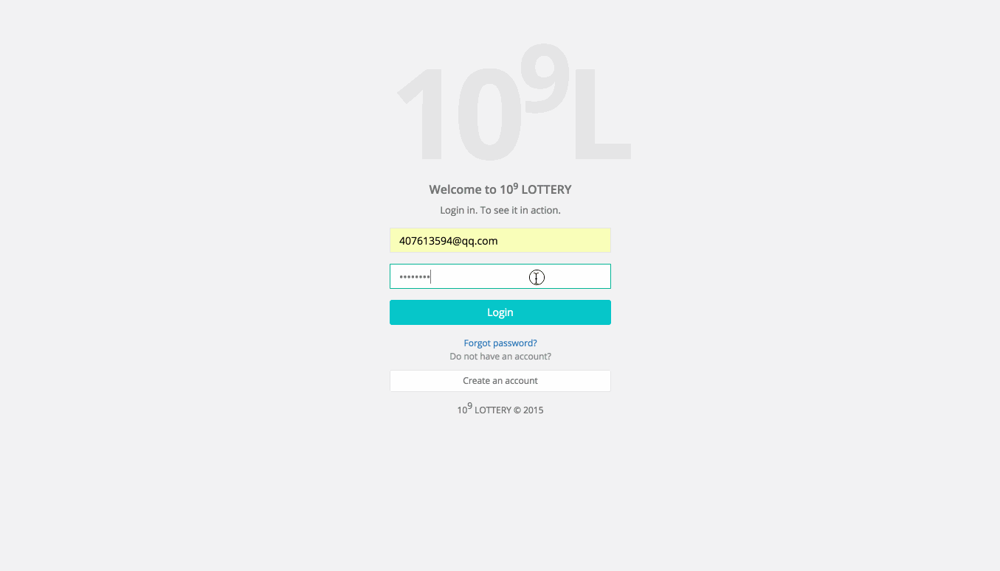
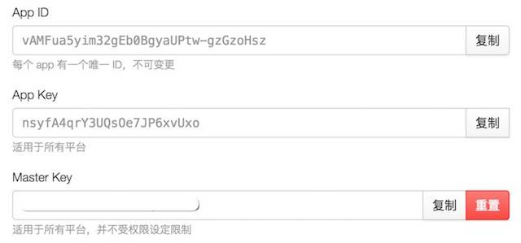
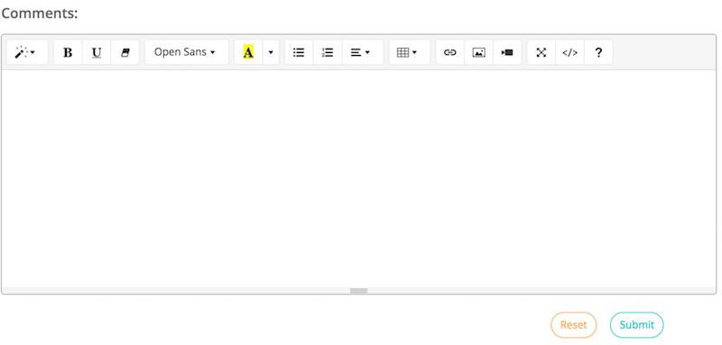
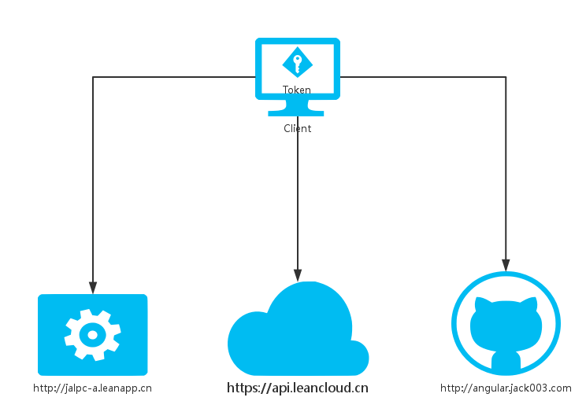

# Jalpc-A.  [](http://JiaKunUp.github.com/Jalpc-A)

[](https://opensource.org/licenses/mit-license.php)
[](http://github.com/badges/stability-badges)

[](https://github.com/ellerbrock/open-source-badge/)
[](http://forthebadge.com)

<http://angular.jack003.com>



Jalpc-A is a front end web application, it is written in Angularjs and the theme is similar with [Jalpc](http://JiaKunUp.github.com/jalpc_jekyll_theme)

We can register an account at this website and login to comment, only admin user can add blogs, if you like you can build a blog which everyone can add blogs,besides the app's backhend platform is based on [Leancloud](https://leancloud.cn/),you can use [Parse](https://parse.com/) as well.

If you like this Jekyll theme,please give me encouragement and star this project,I will make it better.

## Getting Started

If you're completely new to Jekyll, I recommend checking out the documentation at <http://jekyllrb.com> or there's a tutorial by Smashing Magazine.

### Fork, then clone

**Fork** the repo, and then **clone** it so you've got the code locally.

```
$ git clone https://github.com/<your githubname>/Jalpc-A.git
$ cd Jalpc-A
$ gem install jekyll # If you don't have jekyll installed
$ rm -rf _site && jekyll server
```
### Get a Leancloud account

Register an account at **Leancloud** and create a application, then in the settings of application you can get your **App ID** and **App Key**, replace them in `js/app.js`.



> **Parse** is similar.

### Jekyll Serve

Then, start the Jekyll Server. I always like to give the --watch option so it updates the generated HTML when I make changes.

```
$ jekyll serve --watch
```

Now you can navigate to localhost:4000 in your browser to see the site.

### Npm

You can use npm or other local web service to view the web site,remember to remove front matter in `website.html`.

### Using Github Pages

You can host your Jekyll site for free with Github Pages. [Click here](https://pages.github.com) for more information.

A configuration tweak if you're using a gh-pages sub-folder

### CNAME

Replace your website domain in **CNAME** file.

## Features

### Login with github account

You can login with github account,the web application use [leancloud engine](https://github.com/JiaKunUp/Jalpc-A-engine) to realize it.when you logined in,your username in my blog is `gh_<your_github_username>`.

### Web analytics

I use [Google analytics](https://www.google.com/analytics/) to do web analytics, you can register an account and apply an application, just replace the javascript code in `website.html`.

### Rich Text Editor

I use [summernote](https://github.com/summernote/angular-summernote) to generate a rich text editor at web page,you can write many styles of words and add pictures, videos and so on.It's very easy to write an article.
> When you want to upload an image,the image will be uploaded to a background platform(qiniu cloud service).



### Share

Every blog, I generate a QRCode image with [angular-qrcode](https://github.com/monospaced/angular-qrcode),this is the absURL about the blog,you can get the blog in other devices and share.

### Comment

* Login and comment
* Also summernote editor
* Reply to others' comments
* Delete your previous comments

### Pagination

The pagination is baseed on [ui-bootstrap](https://github.com/angular-ui/bootstrap),but there is a small bug: if you put `items-per-page` in html DOM and use page params to get the data with `ui-router`,the page will go to the matching page and return to the first page immediately.So I didn't put it in html,and re calculate the total count, now the url like this: `http://angular.jack003.com/website.html#/blogs/2`, we can go back and go forward through browser between pages.

### Safe

Since the project is **open source**, we must consider user's username and password and safe connection.The below is analysis chart when use access to the website.



Client get the web application files(html,css,js) from `http://angular.jack003.com`, all the user account connections and token connections are with `https://api.leancloud.cn`, and some jsonp scripts are with `http://jalpc-a.leanapp.cn` such as github login and blog's short url.

##

### To Do

* search page
* donate
* message
* send email

### Put in a Jalpc-A Plug

If you want to give credit to the Jalpc-A theme with a link to my personal website <http://angular.jack003.com>, that'd be awesome. No worries if you don't.

### Enjoy

I hope you enjoy using Jalpc-A. If you encounter any issues, please feel free to let me know by creating an issue. I'd love to help.

## Upgrading Jalpc-A

Jalpc-A is always being improved by its users, so sometimes one may need to upgrade.

### Ensure there's an upstream remote

If `git remote -v` doesn't have an upstream listed, you can do the following to add it:

```
git remote add upstream https://github.com/johnotander/pixyll.git
```

### Pull in the latest changes

```
git pull upstream master
```

There may be merge conflicts, so be sure to fix the files that git lists if they occur. That's it!

## Thanks to the following

* [Jekyll](http://jekyllrb.com)
* [Bootstrap](http://www.bootcss.com)
* [ui-router](https://github.com/angular-ui/ui-router)
* [ui-bootstrap](https://github.com/angular-ui/bootstrap)
* [angular-toastr](https://github.com/Foxandxss/angular-toastr)
* [angular-summernote](https://github.com/summernote/angular-summernote)
* [angular-qrcode](https://github.com/monospaced/angular-qrcode)

## Contributing

1. Fork it
2. Create your feature branch (`git checkout -b my-new-feature`)
3. Commit your changes (`git commit -am 'Add some feature'`)
4. Push to the branch (`git push origin my-new-feature`)
5. Create new Pull Request
